# DevSecOps - Projeto Linux 

## Documentação do primeiro projeto proposto na trilha de DevSecOps no meu programa de estágio PB - 2025 

## Objetivo 
Desenvolver e testar habilidades em Linux, AWS e automação de processos através da configuração de um ambiente de servidor web monitorado.

## Requisitos Técnicos 
- Windows 11
- Amazon Linux 2023
- Instância EC2 AWS
- Nginx

## Índice
1. [Configuração do Ambiente](#configuração-do-ambiente)
2. [Configuração do Servidor](#configuração-do-servidor)
3. [Monitoramento e Notificações](#monitoramento-e-notificações)
4. [Automação e Testes](#automação-e-testes)


## 1. Configuração do Ambiente
colocar aqui oq é uma VPC 

### 1.1 Criar uma VPC na AWS
Primeiramente, é necessário criar uma VPC para o seu ambiente. No console da AWS pesquise pelo serviço de `VPC` e criar uma nova VPC de acordo com suas necessidades como na imagem a seguir.
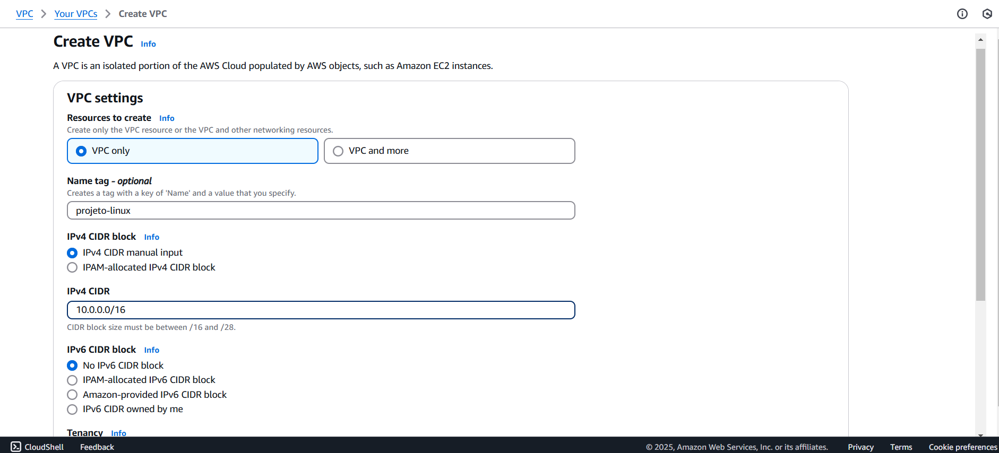

Continuando na configuração da VPC, ainda precisa criar as sub-redes. No seu ambiente, navegue até a sessão de subnets e crie duas públicas e duas privadas. Uma pública e uma privada na região `us-east-1a` e as outras duas na `us-east-1b`.
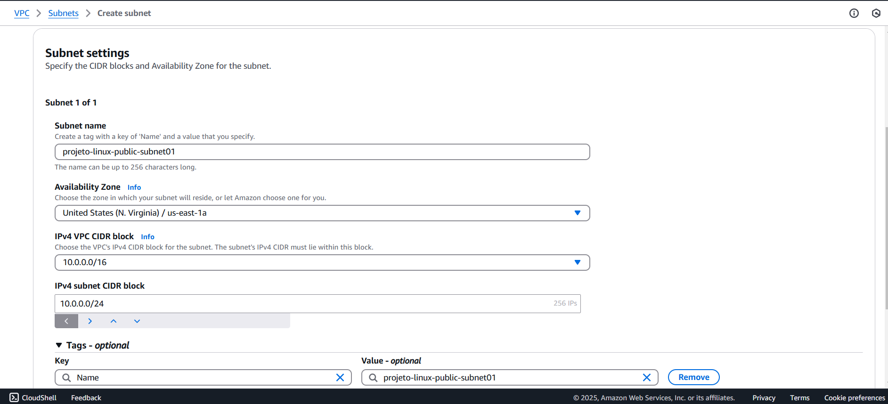

Após a criação das subnets, elas irão aparecer assim na sua console.
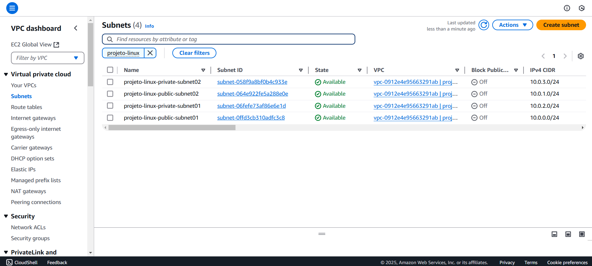

Para contribuir para a comunicação com a internet, é necessário criar um INternet Gateway e anexá-lo à VPC. Ainda no console da AWS no serviço de VPC, navegue até `Internet Gateway` e crie de acordo com suas necessidades. 
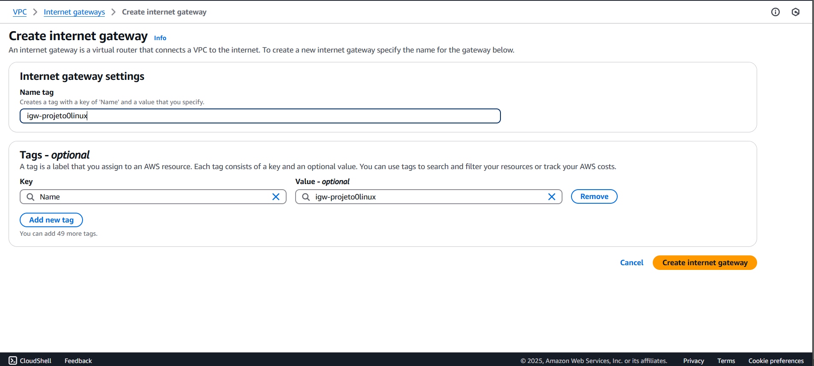

Após a criação é necessário anexá-lo à VPC. Para isso, clique no botão de `actions` e selecione `attach to VPC`.
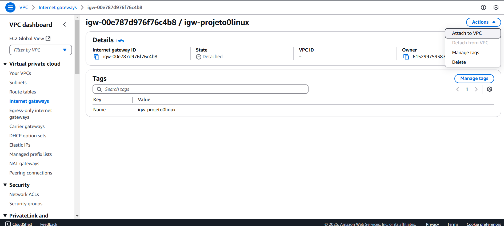

Para permitir que as subnets públicas se comuniquem com o ambiente externo, é necessário criar uma `Route table`. Basta ir até a sessão e criar.
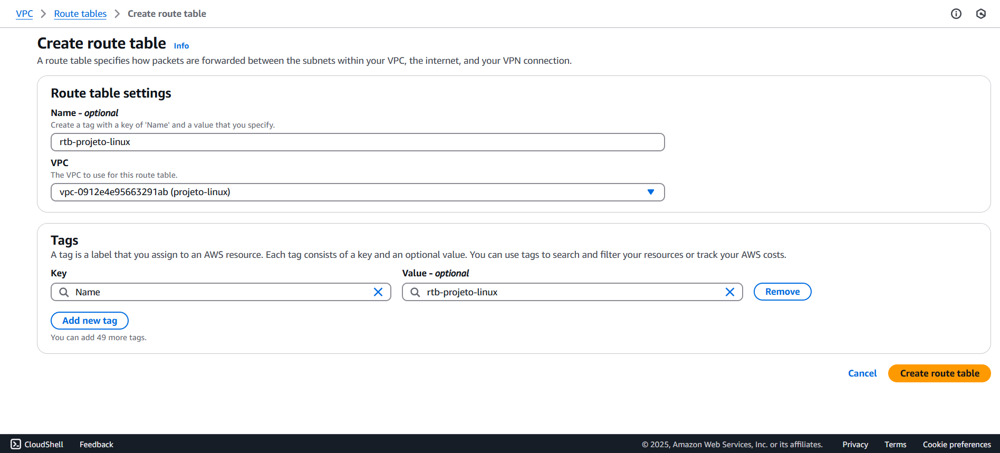

Entretanto, as regras não foram definidas. Logo, selecione a `Route table` criada e edite as regras. Crie uma com destination 0.0.0.0/0 e target para o `Internet Gateway` criado anteriormente.
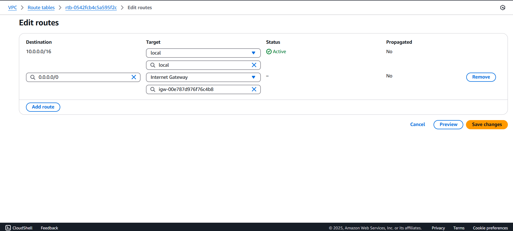

Ainda precisa anexar as subnets públicas à essa `Route Table`. Para isso, selecione-a e navegue até `Subnet Associations`. Por fim, edite selecionando as duas subnets públicas criadas no início.
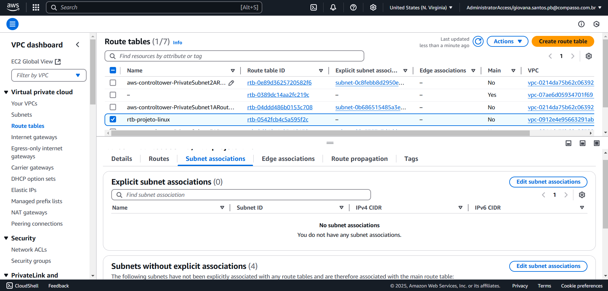

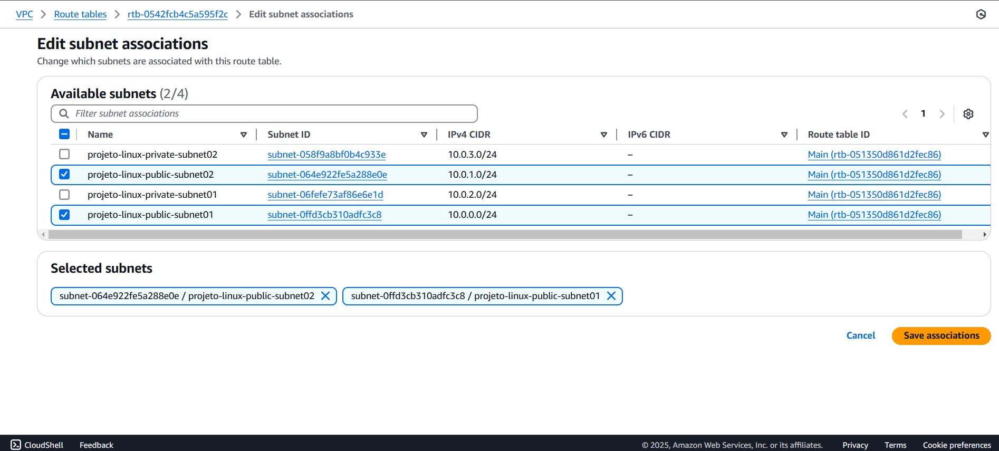

### 1.2 Criar uma instância EC2
Para dar continuidade à configuração do ambiente, chegou a hora de criar a instância EC2. Mas antes é necessário criar as regras de `Security Group`. Para configurar o tráfego da EC2, há a necessidade de criar um Security group. Agora, no console da AWS pesquise pelo serviço de `EC2` e navegue até `Security Group`. Basta criá-lo de acordo com suas necessidades. No na parte de configuração de regras de entrada, criei duas, uma permitindo o tráfego HTTP para qualquer lugar, e outra SSH para o meu IP. Assim como na imagem. As regras de saída deixar o padrão.
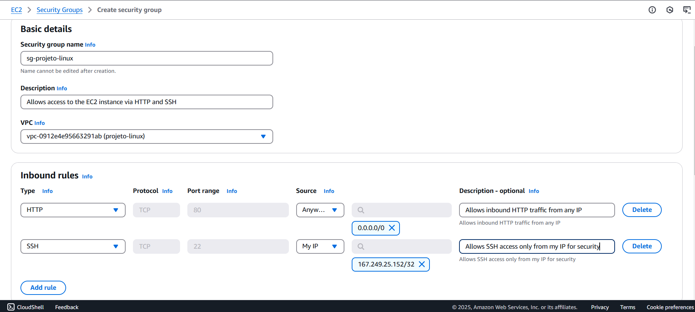

Agora, para criar de fato a instância EC2, no console da AWS pesquise pelo serviço de `EC2`. Navegue até a sessão de `Instâncias` e crie uma de acordo com suas necessidades. No meu caso, escolhi a AMI baseada em Amazon Linux 2023.
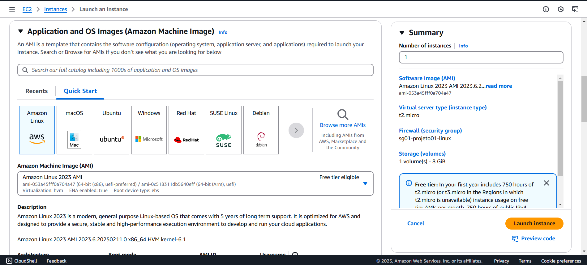

Durante a criação da EC2, ainda é necessário passar pelas `Configurações de Rede`. Nessa parte, as configurações devem estar assim como na imagem abaixo, na VPC criada, assim como na subnet pública, com o IP automático habilitado e no security group. Além disso, vincule uma chave SSH à ela, se voê não tiver, é só criar, pois mais tarde usaremos para conectar à EC2.
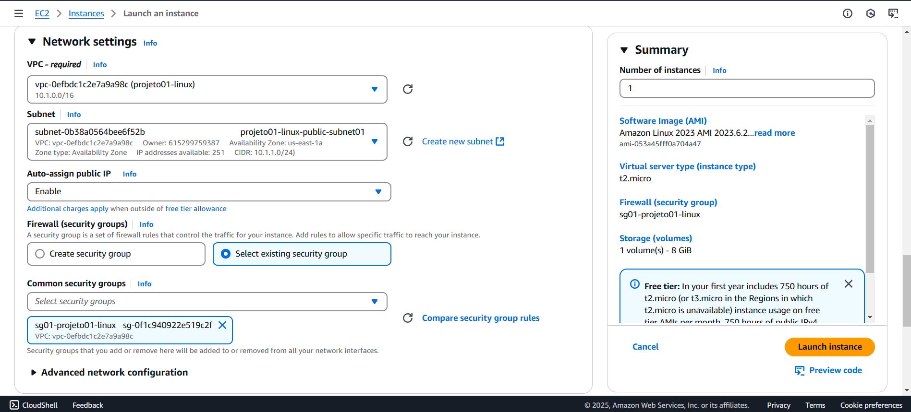

### 1.3 Acessar a instância via SSH 
Agora todo o seu ambiente estará configurado. Por fim, basta acessar a EC2 via SSH. Para isso, selecione a EC2 e clique em `connect` como na imagem abaixo.
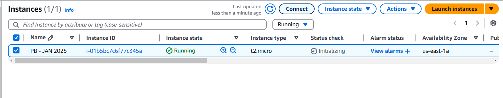

Após isso irá aparecer o passo a passo a ser seguido como na imagem abaixo. Você pode executá-lo no `Git Bash` ou no próprio terminal do `Visual Studio Code`. Em ambos, navegue até a paste onde você baixou a sua chave SSH e execute:
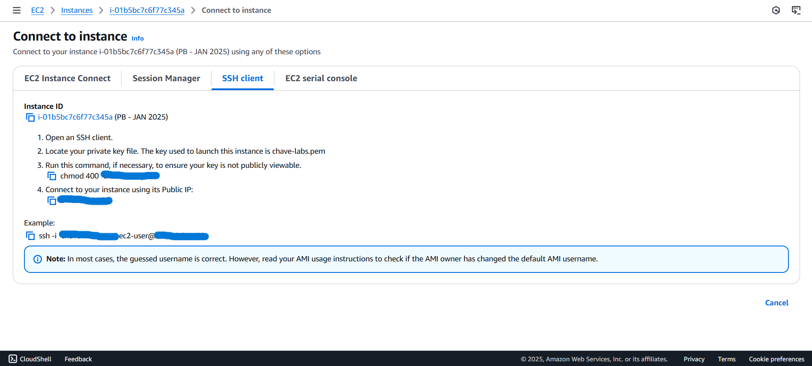

Para modificar o acesso da chave SSH.
```bash
chmod 400 "suaChave.pem"
```

Para entrar na EC2
```bash
ssh -i "suaChave.pem" ec2-user@IpPublicoDaEC2
```

Pronto, você está dentro da EC2!
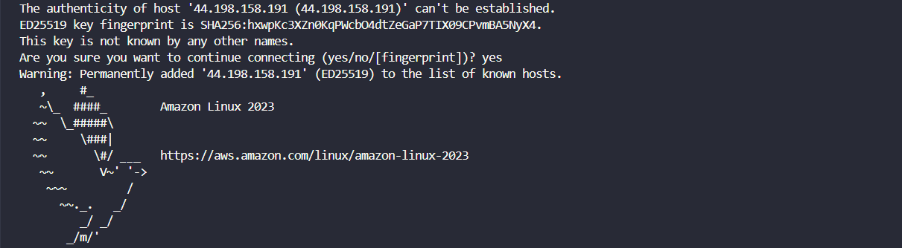


## 2. Configuração do servidor 
### 2.1 Instalar o servidor Nginx na EC2
Para configurar o servidor, nessa etapa é necessário instalar o servidor web Nginx na EC2. Primeiro, abra o Visual Studio COde conectado à instância EC2. Em seguida, é necessário fazer a seguinte verificação:

Para verificar se há alguma verificação pendente, execute:
```bash
sudo dnf update -y
```

Depois, basta instalar o Nginx com o seguinte comando:  
``` bash
sudo dnf install nginx -y
```

Após a instalação ser concluída, a seguinte mensagem aparecerá:


Entretanto, deve-se iniciar o Nginx. Como o serviço do Nginx por padrão vem desabilitado, essa ação é necessária. Para efetuar essa ações é necessário executar os seguintes comandos:
```bash
sudo systemctl start nginx
```
```bash
sudo systemctl enable nginx
```

Depois de seguir essas etapas, verifique se o serviço do Nginx está ativo na sua EC2 com:
```bash
sudo systemctl status nginx
```

A seguinte mensagem irá aparecer se o servidor estiver funcionando:


Ao fim, para testar, basta copiar o IP público da sua instância e colar no navegador. A página que deve ser exibida é: 


### 2.2 Criar uma página HTML simples
Nessa parte, você irá editar a página HTML que está no servidor de acordo com às suas necessidades. O arquivo index.html geralmete fica em `cd /usr/share/nginx/html`. Para editar o arquivo basta executar: 
```bash
sudo nano index.html
```
Depois, basta modificar como deseja e atualizar a página do navegador que as novas informaçõe serão carregadas. De acordo com as orientações do desafio, eu preciso colocar informações sobre o projeto, logo, a minha página HTML ficou assim:


Após a configuração da página, um dos requsitos do projeto é criar um serviço sustemd para garantir que o Nginx reinicie automaticamente se parar. Para isso você deve criar um arquivo `override.conf` para fazer as configurações necessárias. O recomendado pelo `systemd` é criar outro arquivo para nao modificar o original, para evitar que atualizações do Nginx sobrescrevam a configuração. Para criar o arquivo, execute:

```bash
sudo nano /etc/systemd/system/nginx.service.d/override.conf
```

Dentro dele, insira as linhas abaixo. Dessa forma, o sistema irá reiniciar sempre que ele parar em 5 segundos.
```bash 
[Service]
Restart=always
RestartSec=5
```
Para recarregar o deamon a fim de que ele reconheça as mudanças.
```bash
sudo systemctl daemon-reload
```

Para reiniciar o serviço do Nginx.
```bash
sudo systemctl restart nginx 
```

Para simular uma parada, mate o processo com:
```bash
sudo pkill -9 nginx
```

Verifique o status do serviço do Nginx novamente. Ele estará como `ativo` por 4 segundos atrás, observe na imagem abaixo.
```bash
 sudo systemctl status nginx
 ```

 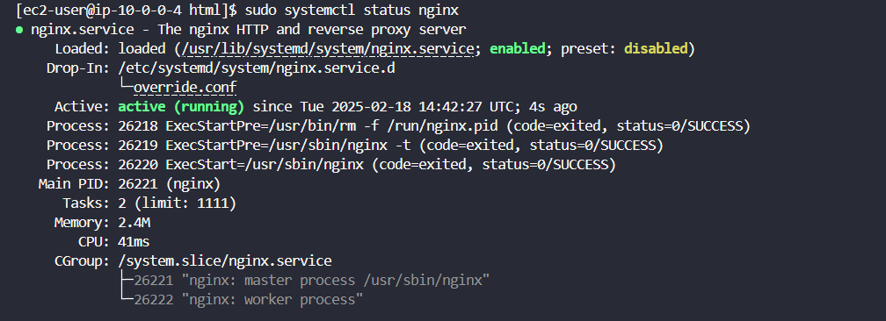

## 3. Monitoramento e notificações
### 3.1 Criar um script em Python para monitorar o site
Os requisitos do script são:
Verificar se o site responde corretamente a uma requisição HTTP.
Criar logs das verificações em /var/log/monitoramento.log.
Enviar uma notificação via Discord, Telegram ou Slack se detectar indisponibilidade.

Antes de criar o script é necessário criar um arquivo de log e um servidor no Discord, pois conforme as orientações do projeto, deve existir um log das verificações do projeto e caso haja detecção de indisponibilidade do site, uma notificação deve ser enviada ao Discord pelo webhook.

No VSCode, para criar um arquivo de log, execute
```bash
sudo touch /var/log/monitoramento.log
```

Com o Discord aberto, crie um servidor com o nome de `notificações-nginx`. Para criar um webhook, clique no ícone de engrenagem ao lado do nome do servidor, clique em integrações, navegue até webhook e crie um novo com o nome de `Notificação`. É necessário copiar a URL do webhook, pois será utilizada no script.

### 3.2 Requisitos do script em Python 
O script deve ser criado com o nome de `monitoramento.py` dentro de `cd /opt`. 

Para criar o script de monitoramento:
```bash
cd /opt
sudo nano monitoramento.py
```

Agora, basta escrever o script. Deve utilizar a biblioteca `Requests` para enviar e receber informações da internet. Para importar:


Depois, deve-se armazenar em variáveis a URL do site, a URL do webhook e o caminho do arquivo de logs. Para isso, adicione as seguintes linhas no seu script


Criar uma função para registrar os logs dentro do arquivo criado anteriormente


Criar uma função para verificar se o site responde corretamente a uma requisição HTTP. A função tenta acessar o site com o requests atráves do método get passando a URL e um tempo de 10 segundos. O código de status é armazenado em uma variável. Se o código for igual a 200, uma mensagem indicando que o site está ativo é exibida. Caso contrário, dará erro, o qual é tratado com `RequestException` exibindo a mensagem de erro. A mensagem de erro também é armazenada no arquivo de log. E também se entrar dentro desse tratamento de erro, a mensagem é enviada ao Discord com a função `enviar_notificação`, que será explicada posteriormente. 


Criar a função de enviar notificação ao Discord. Nela, um dicionário é criado com as mensagens de erro, e depois enviado ao webhook por meio do método `post`como um JSON. É importante ressaltar que o Webhook espera receber os dados como um objeto JSON.


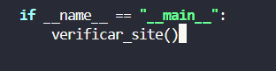

Por fim, é necessário fornecer pemissão de execução ao script, então execute:
```bash
sudo chmod +x /opt/monitoramento.py
```

### 3.3 Configurar o scrpit para rodar automaticamente a cada 1 minuto
Para fazer essa configuração, utilize o crontab. Se você não tiver instalado, basta seguir o passo à passo a seguir:

Para instalar 
```bash 
sudo yum install cronie
```

Para habilitar o serviço
```bash
sudo systemctl enable crond
```

Para inciar o serviço
```bash
sudo systemctl start crond
```

Verificar se o serviço está como `Active`
```bash
sudo systemctl status crond
```

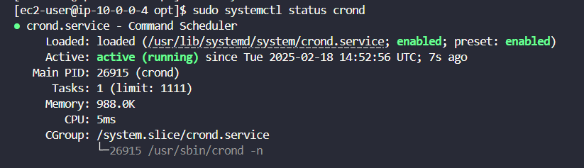

Após seguir o passo à passo, deve-se realizar a configuração. Para isso, execute:

```bash
crontab -e
```

Adicione a seguinte linha e depois pressione `ESC` e `:wq` para sair no VI.
```bash
* * * * * /usr/bin/python3 /opt/monitoramento.py >> /var/log/monitoramento.log 2>&1
```

Após editado, o script começará a ser executado automaticamente, entretanto, ainda é necessário conceder a permissão de escrita ao arquivo de log. Para isso, execute:

```bash
sudo chmod 666 /var/log/monitoramento.log
```

## 4. Automação e Testes
### 4.1 Testar a implementação
Primeiro, verifique se o site está acessível via navegador. Basta copiar o IP pública da sua EC2 e colar no navegador. No meu caso, devido as minhas configurações de HTML e CSS, a minha página irá aparecer assim:


Agora, iremos para o teste do servidor em si. Para rodar o scrip Python, execute:
```bash
python3 monitoramento.py
```
Para verificar se a página está respondendo à requisições HTTP, execute:
```bash
tail -f /var/log/monitoramento.log
```
Com isso, a cada minuto o script vai rodar automaticamente, se a página estiver respondendo à requisições HTTP, isso irá aparecer na tela a cada minuto. Para parar a verificação, é só pressionar `CTRL + C`.

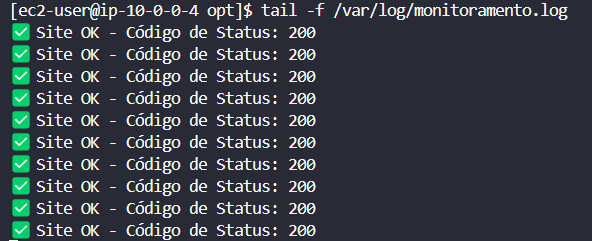

Agora para simular um erro, pare o serviço do Nginx, rode o script e verifique se a página está respondendo.

Para parar o serviço do Nginx:
```bash 
sudo systemctl stop nginx
```
Para rodar o script:
```bash
python3 monitoramento.py
```
Para verificar se a página está respondendo à requisições HTTP, execute:
```bash
tail -f /var/log/monitoramento.log
```

As mensagens de erro já irão começar a aparecer na sua tela assim:
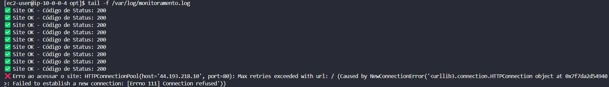

Ao abrir o servidor do `Discord` as notificações de `Site INDISPONÍVEL` também já estarão registradas.


Se você quiser verificar os logs dentro do arquivo que foi criado, execute:

Navegue até a basta onde se encontra o arquivo de log: 
```bash 
cd /var/log
```

Peça para exibir o conteúdo do arquivo com:
```bash 
cat monitoramento.log
```

Na imagem a seguir mostra todos os logs dos testes que eu realizei
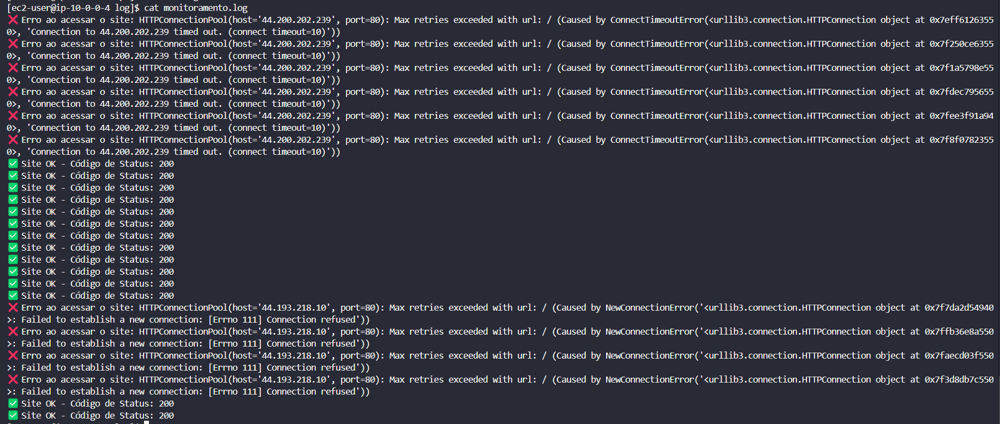

