# DevSecOps - Projeto Linux 

 **Documentação do primeiro projeto proposto na trilha de DevSecOps no meu programa de estágio PB - 2025**  

## 🎯 Objetivo  
Desenvolver e testar habilidades em **Linux**, **AWS** e **automação de processos** através da configuração de um ambiente de servidor web monitorado.

## 🛠️ Requisitos Técnicos  
- **Windows 11**  
- **Amazon Linux 2023**  
- **Instância EC2 AWS**  
- **Nginx**  


### 🔹 Tecnologias Utilizadas  
<p align="left">
  
  
  
</p> 

## 📑 Índice  
1. [Configuração do Ambiente](#1-configuração-do-ambiente)  
2. [Configuração do Servidor](#2-configuração-do-servidor)  
3. [Monitoramento e Notificações](#3-monitoramento-e-notificações)  
4. [Automação e Testes](#4️-automação-e-testes)  


## 1. Configuração do Ambiente  

### 📌 O que é uma VPC?  
A **VPC (Virtual Private Cloud)** é uma rede virtual privada dentro da AWS, permitindo isolar e configurar seus recursos da maneira que desejar. Com ela, é possível dividir a rede em **sub-redes (subnets)**, definir tabelas de roteamento, configurar gateways de acesso e controlar a segurança através de grupos de segurança e listas de controle de acesso (ACLs).  

Criar uma VPC personalizada garante maior controle sobre a comunicação entre seus recursos e o acesso à internet, sendo um requisito essencial para a maioria dos projetos que envolvem infraestrutura na nuvem.  

---

### 1.1 Criar uma VPC na AWS  
O primeiro passo para configurar seu ambiente na AWS é criar uma VPC personalizada. No console da AWS, pesquise pelo serviço **VPC** e crie uma nova, definindo um **bloco CIDR** adequado para sua rede (por exemplo, `10.0.0.0/16` permite criar até 65.536 endereços IP privados dentro dessa VPC).  

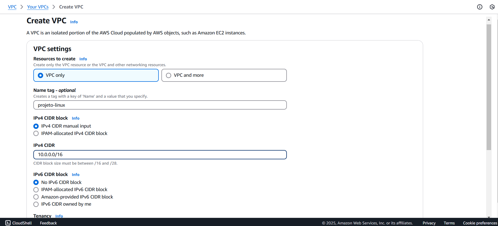  

Após criar a VPC, será necessário configurar as **subnets**, que são divisões menores dentro da VPC. As subnets permitem organizar os recursos e distribuir a carga de trabalho em diferentes zonas de disponibilidade.  

1️⃣ Acesse a seção de Subnets no console da AWS

2️⃣ Crie quatro subnets:  
   - **Duas públicas** (acessíveis pela internet)  
   - **Duas privadas** (acessíveis apenas dentro da VPC) 

3️⃣ Distribua as subnets entre diferentes zonas de disponibilidade, por exemplo:  
   - **us-east-1a** → 1 subnet pública e 1 privada  
   - **us-east-1b** → 1 subnet pública e 1 privada  

Isso melhora a **alta disponibilidade** do ambiente, garantindo que, caso uma zona fique indisponível, a outra ainda estará funcionando.  

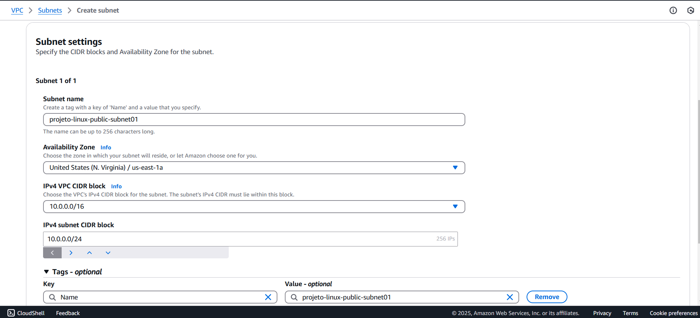  

Após a criação, as subnets aparecerão listadas no console da AWS:  

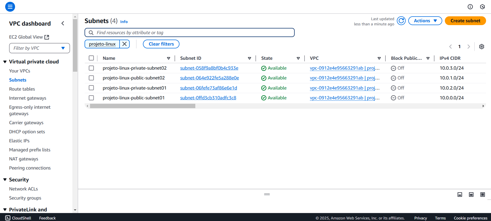  

---

#### 🔹 Configurar Acesso à Internet  

Por padrão, uma VPC recém-criada não tem conexão direta com a internet. Para permitir que as **subnets públicas** acessem a internet (e sejam acessadas externamente), precisamos configurar dois elementos fundamentais:  

✅ **Internet Gateway (IGW)** → Responsável por fornecer acesso à internet para os recursos da VPC  
✅ **Route Table** → Controla como o tráfego é roteado dentro da VPC  

#### 🔹 Criando um Internet Gateway  
O **Internet Gateway (IGW)** é um componente que permite que recursos dentro da VPC se comuniquem com a internet. Sem ele, mesmo que a instância tenha um IP público, não será possível acessar nada externo.  

1️⃣ No console da AWS, vá até **Internet Gateway** e clique em **Criar Internet Gateway**.  
2️⃣ Após a criação, é necessário anexá-lo à VPC clicando em **Attach to VPC**.  

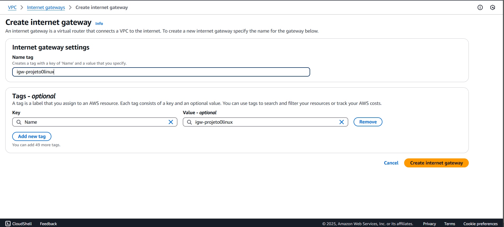  
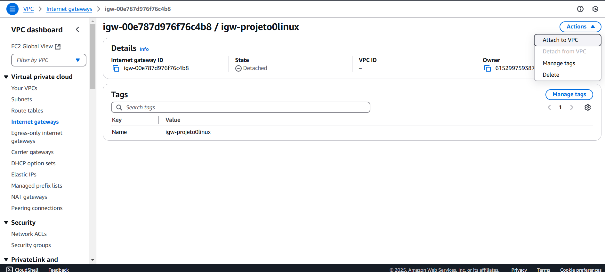  

#### 🔹 Criando uma Route Table  
A **Route Table** define quais caminhos (rotas) o tráfego de rede deve seguir dentro da VPC. Por padrão, todas as subnets criadas usam a **route table principal**, que só permite comunicação interna.  

Para permitir que as **subnets públicas** acessem a internet:  

1️⃣ Vá até **Route Tables** no console da VPC e crie uma nova tabela de rotas.  
2️⃣ Adicione uma **rota com destino `0.0.0.0/0`** apontando para o **Internet Gateway (IGW)** criado anteriormente. Isso garante que qualquer tráfego externo será roteado para a internet.  

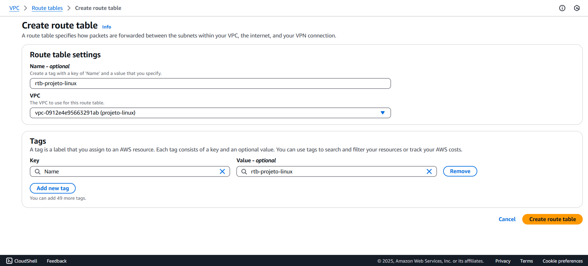  
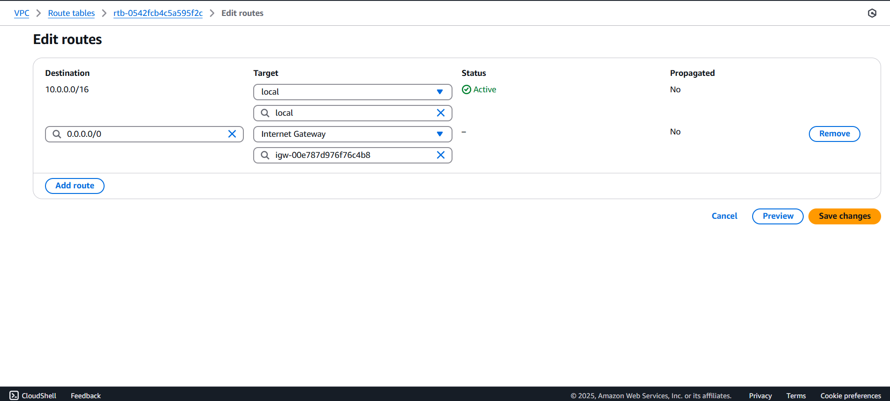  

3️⃣ Agora, associe as **subnets públicas** a essa nova Route Table:  
   - Vá até **Subnet Associations**  
   - Edite e selecione as duas **subnets públicas**  

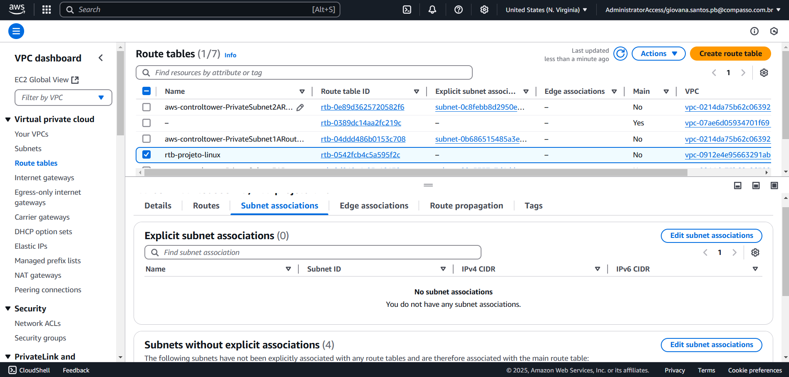  

Agora, suas **subnets públicas** podem acessar a internet!  

---

### 1.2 Criar uma instância EC2  
Com a VPC configurada, podemos criar uma **instância EC2**, que será o servidor web do nosso projeto.  

Antes disso, é essencial configurar um **Security Group**, que atua como um firewall controlando o tráfego de entrada e saída da instância.  

#### 🔹 Criando um Security Group  
No console da AWS, acesse **EC2 → Security Groups** e crie um novo com as seguintes regras:  

✅ **Regra de entrada:**  
   - **HTTP (porta 80)** → Permite tráfego de qualquer origem (`0.0.0.0/0`)  
   - **SSH (porta 22)** → Permite apenas o acesso do seu IP (`Meu IP`) para garantir segurança  

✅ **Regra de saída:**  
   - Permitir todo o tráfego de saída (padrão)

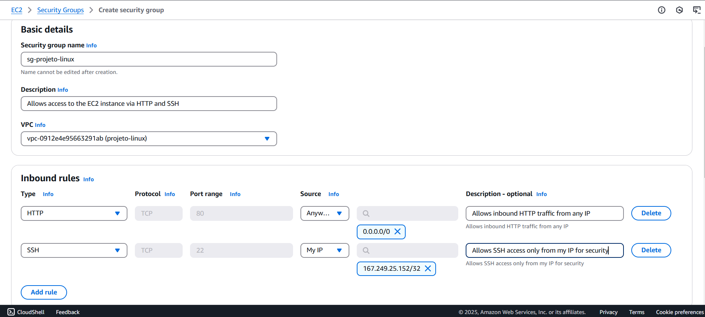  

Agora podemos criar a instância EC2:  

1️⃣ No console da AWS, vá até **EC2 → Instâncias** e clique em **Criar Instância**  
2️⃣ Escolha a **AMI Amazon Linux 2023**  
3️⃣ **Configure uma chave SSH** para permitir acesso remoto à instância 

4️⃣ Configure as opções de rede:  
   - Selecione a **VPC criada** anteriormente  
   - Escolha uma **subnet pública**  
   - Ative o **IP público automático**  
   - Associe o **Security Group** criado  


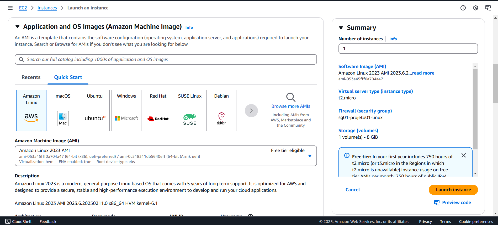  
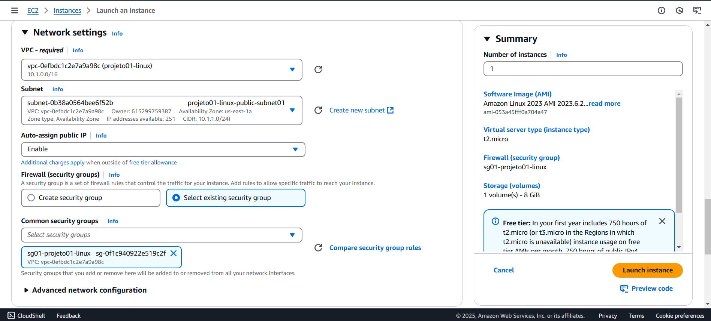  

---

### 1.3 Acessar a instância via SSH  

Agora que a EC2 está criada, podemos acessá-la via **SSH**.  

No console da AWS, selecione a instância e clique em **Connect**. A AWS fornecerá instruções para conexão via terminal:  

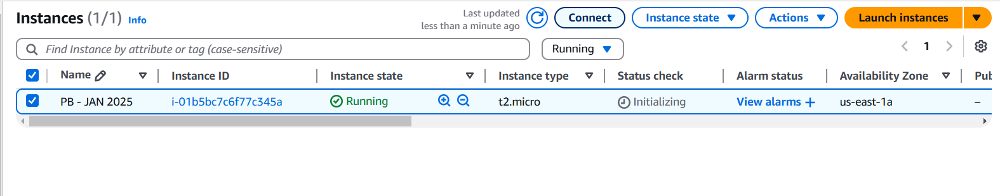  

> **Nota de Atenção**:  
> Os comandos descritos foram executados no terminal do Visual Studio Code, localizado na pasta onde a chave SSH foi baixada. Certifique-se de estar na pasta correta com a chave SSH configurada para garantir que todas as conexões e comandos relacionados ao seu servidor EC2 funcionem corretamente.

Antes de conectar, precisamos alterar as permissões da chave SSH,  deixando a chave acessível apenas para o proprietário (400 significa somente leitura para o dono), com o comando:  
```bash
chmod 400 "suaChave.pem"
```

Agora podemos conectar à EC2 executando:
```bash
ssh -i "suaChave.pem" ec2-user@IpPublicoDaEC2
```

Caso tudo esteja certo, veremos a tela de conexão:


## 2. Configuração do Servidor  

### 2.1 Instalar o servidor Nginx na EC2  

O **Nginx** é um servidor web leve e de alto desempenho, amplamente utilizado para hospedar sites e aplicações web. Nesta etapa, instalaremos e configuraremos o Nginx na nossa instância EC2.  

#### 🔹 Conectando-se à EC2  

Antes de iniciar a configuração, certifique-se de que está conectado à instância EC2 via **SSH** ou através do **Visual Studio Code**.  

Se estiver usando o terminal SSH, conecte-se com:  
```bash
ssh -i "suaChave.pem" ec2-user@IpPublicoDaEC2
```

#### 🔹 Atualizar pacotes do sistema
É recomendável atualizar os pacotes do sistema antes da instalação, garantindo que todas as dependências estejam atualizadas. Para isso, execute:

```bash
sudo dnf update -y
```

Depois, basta instalar o Nginx com o seguinte comando:  
``` bash
sudo dnf install nginx -y
```

Após a instalação ser concluída, a seguinte mensagem aparecerá:
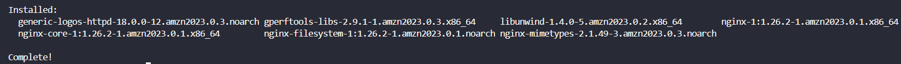

#### 🔹 Iniciar e habilitar o Nginx
Por padrão, o serviço do Nginx vem desabilitado no sistema. Para garantir que ele seja iniciado e configurado para rodar automaticamente no boot, execute:
```bash
sudo systemctl start nginx
```
```bash
sudo systemctl enable nginx
```

#### 🔹 Verificar se o Nginx está rodando
Para confirmar se o Nginx foi iniciado corretamente, execute:
```bash
sudo systemctl status nginx
```

A seguinte mensagem irá aparecer se o servidor estiver funcionando:
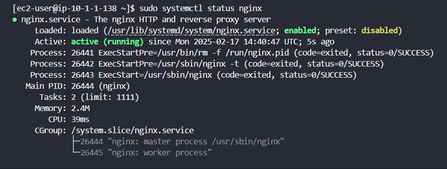

#### 🔹 Testar no navegador
Copie o IP público da sua instância e cole no navegador. A página padrão do Nginx será exibida:


### 2.2 Criar uma página HTML simples
Agora, personalizaremos a página inicial do servidor web. O arquivo principal do site geralmente fica no seguinte diretório:  
```bash
cd /usr/share/nginx/html
```

Para editar o arquivo index.html:
diretório:  
```bash
sudo nano index.html
```

Modifique o conteúdo conforme desejar e salve (CTRL + X, Y, Enter).

Após editar, atualize a página no navegador para ver as mudanças.

No meu caso, como preciso adicionar informações sobre o projeto, minha página HTML ficou assim:

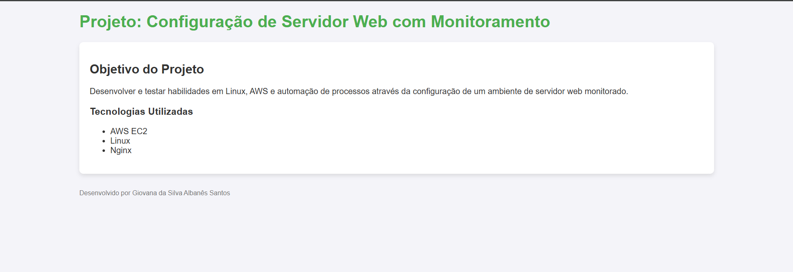

### 2.3 Garantir que o Nginx reinicie automaticamente
Para evitar que o serviço do Nginx fique offline caso ele falhe ou o servidor reinicie, criaremos uma configuração no systemd para garantir que ele seja reiniciado automaticamente.

#### 🔹 Criar um arquivo de configuração no systemd
#### 📌 Systemd
O systemd é um sistema de gerenciamento de serviços e inicialização em Linux, responsável por iniciar e controlar processos do sistema.

O recomendado pelo systemd é criar um arquivo separado em vez de modificar o original, pois isso evita que atualizações do Nginx sobrescrevam as alterações.

Crie o arquivo de configuração em:

```bash
sudo nano /etc/systemd/system/nginx.service.d/override.conf
```

Dentro do arquivo, adicione o seguinte conteúdo:
```bash 
[Service]
Restart=always
RestartSec=5
```
Isso fará com que o sistema tente reiniciar o Nginx sempre que ele parar, com um intervalo de 5 segundos entre cada tentativa.

#### 🔹 Aplicar as alterações
#### 📌 Daemon
Um daemon é um programa que roda em segundo plano, sem interação direta com o usuário, geralmente realizando tarefas contínuas ou agendadas, como servidores de rede ou processos de monitoramento.

Depois de criar o arquivo, recarregue o daemon do systemd para que ele reconheça as mudanças:
```bash
sudo systemctl daemon-reload
```

Reinicie o serviço do Nginx:
```bash
sudo systemctl restart nginx 
```
Agora, se o Nginx for finalizado, ele será reiniciado automaticamente.

#### 🔹 Testar a configuração
Para simular uma falha e verificar se o sistema está reiniciando o Nginx corretamente, mate o processo com:
```bash
sudo pkill -9 nginx
```

Agora, verifique o status do serviço novamente:
```bash
 sudo systemctl status nginx
 ```

 Se a configuração estiver correta, o serviço será reiniciado automaticamente e você verá algo como:
 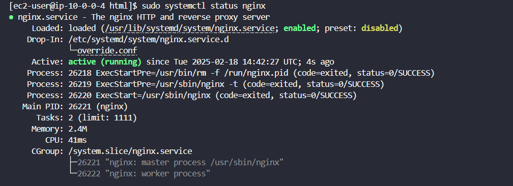

## 3. Monitoramento e Notificações  

Garantir que o site esteja sempre disponível é essencial para evitar problemas e garantir uma boa experiência ao usuário. Para isso, será criado um script em Python que irá monitorar a disponibilidade do site, registrar logs das verificações e enviar notificações para um servidor do Discord caso o site fique indisponível.

---

### 3.1 Criar um script em Python para monitorar o site  

O script de monitoramento terá os seguintes requisitos:

✅ Verificar se o site responde corretamente a uma requisição HTTP.  
✅ Criar logs das verificações no arquivo `/var/log/monitoramento.log`.  
✅ Enviar uma notificação para um servidor do Discord caso o site fique fora do ar.  

Antes de criar o script, é necessário:
1. **Criar o arquivo de log** dentro da EC2 para armazenar as verificações:
   ```bash
   sudo touch /var/log/monitoramento.log
   ```
2. **Criar um servidor no Discord** chamado `notificações-nginx`. 
   - Basta clicar no ícone de "+" no canto superior esquerdo e criar o seu servidor.
   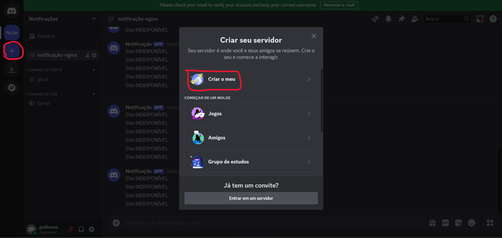

3. **Criar um webhook no Discord** para receber as notificações:
   - Vá até o servidor criado.
   - Clique no ícone de Configurações do Servidor.
   - Vá para **Integrações > Webhooks**.
   - Crie um novo webhook chamado `Notificação`.
   - **Copie a URL do webhook**, pois será utilizada no script.
   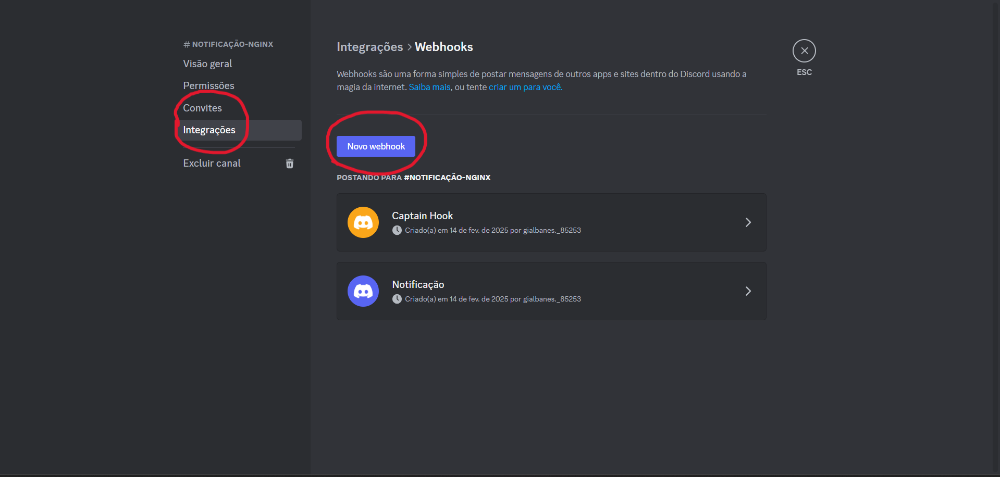

---

### 3.2 Criar o script de monitoramento  
O script será criado diretamente dentro da instância EC2, pois ele precisa rodar no próprio servidor para monitorar o site de forma eficiente. Para manter a organização do sistema, o arquivo será salvo no diretório `/opt`, que é o local padrão para armazenar scripts e softwares adicionais que não fazem parte do sistema operacional principal.

1. Acesse o diretório correto:
   ```bash
   cd /opt
   ```
2. Crie o arquivo:
   ```bash
   sudo nano monitoramento.py
   ```
3. Agora, escreva o código do script.

#### 🔹 Bibliotecas necessárias
#### 📌 Requests
A biblioteca `requests` é uma ferramenta para fazer requisições HTTP em Python. Ela permite enviar requisições como GET, POST, PUT, DELETE, entre outras. É muito utilizada para acessar dados pela web.

O script usará a biblioteca `requests` para realizar as requisições HTTP. Para importá-la, adicione:
```python
import requests
```


#### 🔹 Definir variáveis principais
Adicione as seguintes linhas no seu script para armazenar a URL do site, a URL do webhook e o caminho do arquivo de logs:
```python
url = "https://seusite.com"
webhook = "https://discord.com/api/webhooks/SEU_WEBHOOK"
log_file = "/var/log/monitoramento.log"
```

#### 🔹 Criar função para registrar logs
Essa função permitirá armazenar todas as verificações no arquivo de log. Ela recebe uma mensagem como parâmetro e a adiciona ao arquivo de log. O modo `"a"` (append) garante que as novas mensagens sejam adicionadas ao final do arquivo, sem sobrescrever os logs anteriores
```python
def registrar_log(mensagem):
    with open(LOG_FILE, "a") as log:
        log.write(mensagem + "\n")
```

#### 🔹 Criar função para verificar a disponibilidade do site 
Esta função tenta acessar o site a cada 10 segundos e verifica se ele responde corretamente (código 200), significa que o site está acessível. Caso contrário, um erro será registrado no log e uma notificação será enviada ao Discord.

```python
def verificar_site():
    try:
        res = requests.get(URL_SITE, timeout=10)
        if res.status_code == 200:
            mensagem = f"✅ Site OK!"
        else:
            mensagem = f"⚠️ Site retornou um status inesperado: {res.status_code}"
            enviar_notificacao(mensagem)
        registrar_log(mensagem)
    except requests.RequestException as erro:
        mensagem = f"❌ Site INDISPONÍVEL! Erro: {erro}"
        registrar_log(mensagem)
        enviar_notificacao(mensagem)
```

#### 🔹 Criar função para enviar notificações ao Discord
Esta função monta um JSON com a mensagem de erro e usa a URL do webhook do Discord para enviar a notificação. Dessa forma, sempre que o site ficar fora do ar, um alerta será enviado.
```python
def enviar_notificacao(mensagem):
    dados = {"content": mensagem}
    requests.post(WEBHOOK_URL, json=dados)
```

#### 🔹 Tornar o script executável
Para que o script possa ser executado diretamente, conceda permissão de execução:
```bash
sudo chmod +x /opt/monitoramento.py
```

---

### 3.3 Automatizar a execução do script a cada 1 minuto  
Vamos configurar o **Crontab** para que o script seja executado a cada 1 minuto.

### 🔹 O que é o Crontab?
O `cron` é um agendador de tarefas do Linux que permite executar comandos automaticamente em intervalos de tempo definidos.

#### 🔹 Instalar e ativar o serviço `crond` (caso ainda não esteja instalado):
```bash
sudo yum install cronie -y
sudo systemctl enable crond
sudo systemctl start crond
sudo systemctl status crond
```
Se o serviço estiver ativo, continue para o próximo passo.

#### 🔹 Configurar o `cron` para executar o script a cada minuto:
```bash
crontab -e
```
Adicione a seguinte linha no final do arquivo:
```bash
* * * * * /usr/bin/python3 /opt/monitoramento.py >> /var/log/monitoramento.log 2>&1
```

A sequência de asteriscos representa a agenda de execução do cron, onde cada asterisco indica um campo específico do tempo:


Todos os campos estão preenchidos com asterisco, o que significa que o script será executado a cada minuto, todos os dias, o tempo todo. Além disso, tanto mensagens normais quanto mensagens de erro serão registradas no log, facilitando a depuração caso algo dê errado no script.

Pressione `ESC`, depois `:wq` para salvar e sair.

#### 🔹 Garantir permissão de escrita no arquivo de log:
Alterar as permissões do arquivo de log para permitir que qualquer usuário do sistema possa ler e escrever nele.
```bash
sudo chmod 666 /var/log/monitoramento.log
```

✅ O primeiro 6 → Permissão de leitura (r) e escrita (w) para o dono do arquivo.

✅ O segundo 6 → Permissão de leitura (r) e escrita (w) para o grupo do arquivo.

✅ O terceiro 6 → Permissão de leitura (r) e escrita (w) para outros usuários.

---

## 4️. Automação e Testes  

### 4.1 Testar a implementação  

#### 🔹 Testar se o site está acessível 
Abra o navegador e digite o IP público da sua EC2. Se tudo estiver configurado corretamente, a página deverá carregar normalmente. 

#### 🔹 Rodar o script manualmente para testar
Executar o script de monitoramento manualmente para garantir que ele esteja funcionando como esperado. Esse comando executa o script Python monitoramento.py, localizado em /opt/. 
```bash
python3 /opt/monitoramento.py
```

#### 🔹 Verificar os logs em tempo real
Monitorar os logs gerados pelo script em tempo real para identificar problemas ou comportamentos inesperados. O comando `tail -f `exibe as últimas linhas de um arquivo e continua atualizando a tela com novas entradas do arquivo. 
```bash
tail -f /var/log/monitoramento.log
```

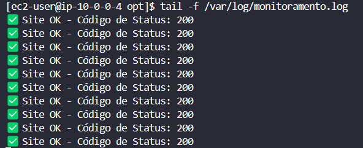

#### 🔹 Simular um erro 
Testar se o script consegue identificar e registrar erros adequadamente. O comando `systemctl stop nginx` para o serviço do Nginx, que é responsável por servir o site, isso simula uma falha no servidor web. Parando o serviço do Nginx, você cria uma condição de erro que deve ser registrada pelo script. O script deve detectar que o serviço Nginx não está funcionando e gerar uma notificação de falha.
```bash
sudo systemctl stop nginx
```
Execute novamente o script após a falha do Nginx. O script deve verificar o estado do Nginx e registrar o erro no log.
```bash
python3 /opt/monitoramento.py
```
Confirmar que a falha foi registrada no log e que o comportamento do script está correto.
```bash
tail -f /var/log/monitoramento.log
```
Se tudo estiver funcionando, mensagens de erro aparecerão no log e uma notificação será enviada ao Discord. 
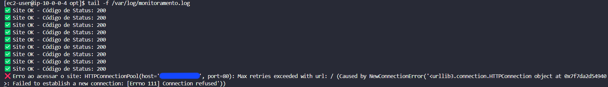


#### 🔹 Reiniciar o Nginx após o teste
Restaurar o serviço Nginx para garantir que o sistema volte ao funcionamento normal.
```bash
sudo systemctl start nginx
```

#### 🔹 Visualizar todos os logs registrados
Verificar o log completo para garantir que todos os eventos, incluindo falhas e recuperação, foram registrados corretamente. O comando cd /var/log muda o diretório de trabalho para o diretório de logs do sistema. O comando cat monitoramento.log exibe o conteúdo completo do arquivo de log monitoramento.log.
```bash
cd /var/log
cat monitoramento.log
```

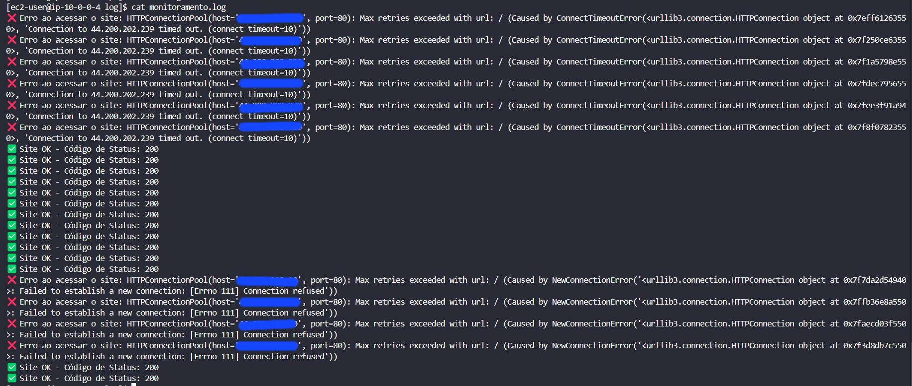

## 🏁 Conclusão
O projeto foi concluído com sucesso, resultando em um ambiente seguro, automatizado e monitorado na AWS. Através da implementação de uma VPC estruturada com subnets públicas e privadas, a configuração de uma instância EC2 com Nginx e a automação do monitoramento com scripts e notificações, o sistema agora possui uma infraestrutura confiável para hospedar aplicações web.

Os principais objetivos foram alcançados:
✅ Configuração de rede com controle de tráfego adequado.
✅ Implementação de servidor web acessível via domínio/IP público.
✅ Monitoramento contínuo para detectar falhas e alertar via webhook.
✅ Automação de processos para garantir eficiência e segurança.

