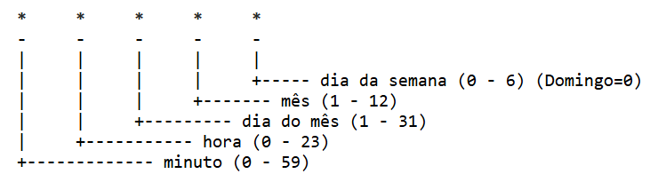

# DevSecOps - Projeto Linux 

## Documentação do primeiro projeto proposto na trilha de DevSecOps no meu programa de estágio PB - 2025 

## Objetivo 
Desenvolver e testar habilidades em Linux, AWS e automação de processos através da configuração de um ambiente de servidor web monitorado.

## Requisitos Técnicos 
- Windows 11
- Amazon Linux 2023
- Instância EC2 AWS
- Nginx

## Índice
1. [Configuração do Ambiente](#configuração-do-ambiente)
2. [Configuração do Servidor](#configuração-do-servidor)
3. [Monitoramento e Notificações](#monitoramento-e-notificações)
4. [Automação e Testes](#automação-e-testes)


## 1. Configuração do Ambiente
## 2. Configuração do servidor 
### 2.1 Instalar o servidor Nginx na EC2
Para configurar o servidor, nessa etapa é necessário instalar o servidor web Nginx na EC2. Primeiro, abra o Visual Studio COde conectado à instância EC2. Em seguida, é necessário fazer a seguinte verificação:

Para verificar se há alguma verificação pendente, execute:
```bash
sudo dnf update -y
```

Depois, basta instalar o Nginx com o seguinte comando:  
``` bash
sudo dnf install nginx -y
```

Após a instalação ser concluída, a seguinte mensagem aparecerá:


Entretanto, deve-se iniciar o Nginx. Como o serviço do Nginx por padrão vem desabilitado, essa ação é necessária. Para efetuar essa ações é necessário executar os seguintes comandos:
```bash
sudo systemctl start nginx
```
```bash
sudo systemctl enable nginx
```

Depois de seguir essas etapas, verifique se o serviço do Nginx está ativo na sua EC2 com:
```bash
sudo systemctl status nginx
```

A seguinte mensagem irá aparecer se o servidor estiver funcionando:


Ao fim, para testar, basta copiar o IP público da sua instância e colar no navegador. A página que deve ser exibida é: 


### 2.2 Criar uma página HTML simples
Nessa parte, você irá editar a página HTML que está no servidor de acordo com às suas necessidades. O arquivo index.html geralmete fica em `cd /usr/share/nginx/html`. Para editar o arquivo basta executar: 
```bash
sudo nano index.html
```
Depois, basta modificar como deseja e atualizar a página do navegador que as novas informaçõe serão carregadas. De acordo com as orientações do desafio, eu preciso colocar informações sobre o projeto, logo, a minha página HTML ficou assim:


## 3. Monitoramento e notificações
### 3.1 Criar um script em Python para monitorar o site
Os requisitos do script são:
Verificar se o site responde corretamente a uma requisição HTTP.
Criar logs das verificações em /var/log/monitoramento.log.
Enviar uma notificação via Discord, Telegram ou Slack se detectar indisponibilidade.

Antes de criar o script é necessário criar um arquivo de log e um servidor no Discord, pois conforme as orientações do projeto, deve existir um log das verificações do projeto e caso haja detecção de indisponibilidade do site, uma notificação deve ser enviada ao Discord pelo webhook.

No VSCode, para criar um arquivo de log, execute
```bash
sudo touch /var/log/monitoramento.log
```

Com o Discord aberto, crie um servidor com o nome de `notificações-nginx`. Para criar um webhook, clique no ícone de engrenagem ao lado do nome do servidor, clique em integrações, navegue até webhook e crie um novo com o nome de `Notificação`. É necessário copiar a URL do webhook, pois será utilizada no script.

### 3.2 Requisitos do script em Python 
O script deve ser criado com o nome de `monitoramento.py` dentro de `cd /opt`. 

Para criar o script de monitoramento:
```bash
cd /opt
sudo nano monitoramento.py
```

Agora, basta escrever o script. Deve utilizar a biblioteca requests `Requests` para enviar e receber informações da internet. Para importar:


Depois, deve-se armazenar em variáveis a URL do site, a URL do webhook e o caminho do arquvio de logs. Para isso, adicione as seguintes linhas no seu script


Criar uma função para registrar os logs dentro do arquivo criado anteriormente


Criar uma função para verificar se o site responde corretamente a uma requisição HTTP. A função tenta acessar o site com o requests atráves do método get passando a URL e um tempo de 10 segundos. O código de status é armazenado em uma variável. Se o código for igual a 200, uma mensagem indicando que o site está ativo é exibida. Caso contrário, dará erro, o qual é tratado com `RequestException` exibindo a mensagem de erro. A mensagem de erro também é armazenada no arquivo de log. E também se entrar dentro desse tratamento de erro, a mensagem é enviada ao Discord com a função `enviar_notificação`, que será explicada posteriormente. 


Criar a função de enviar notificação ao Discord. Nela, um dicionário é criado com as mensagens de erro, e depois enviado ao webhook por meio do método `post`como um JSON.


